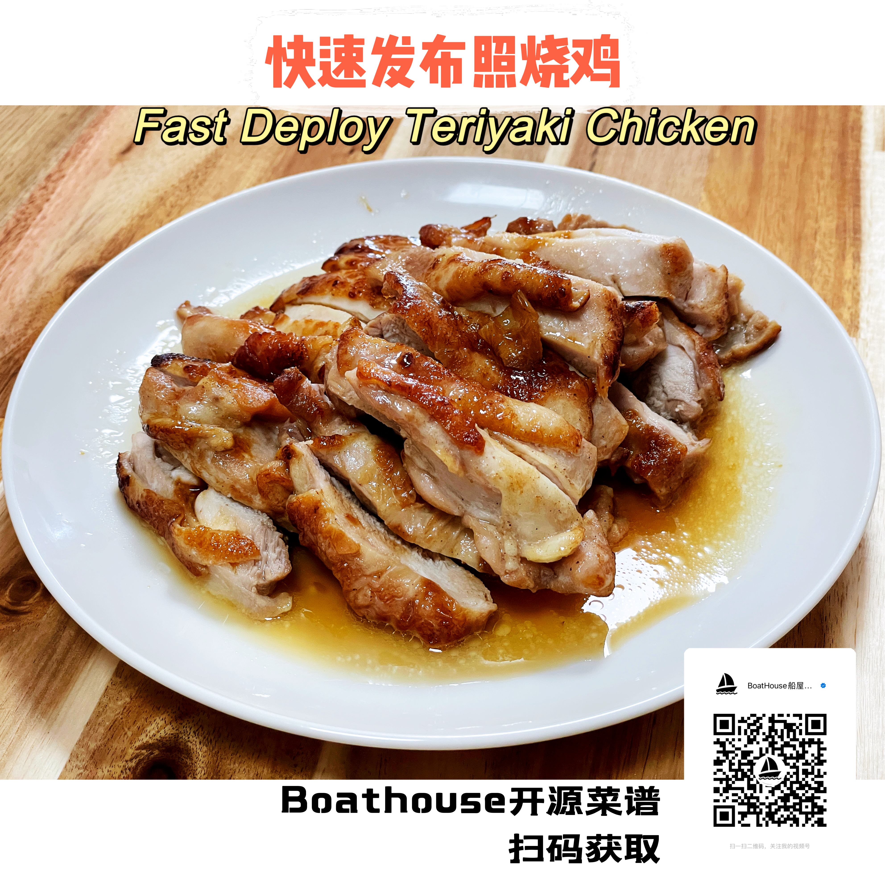
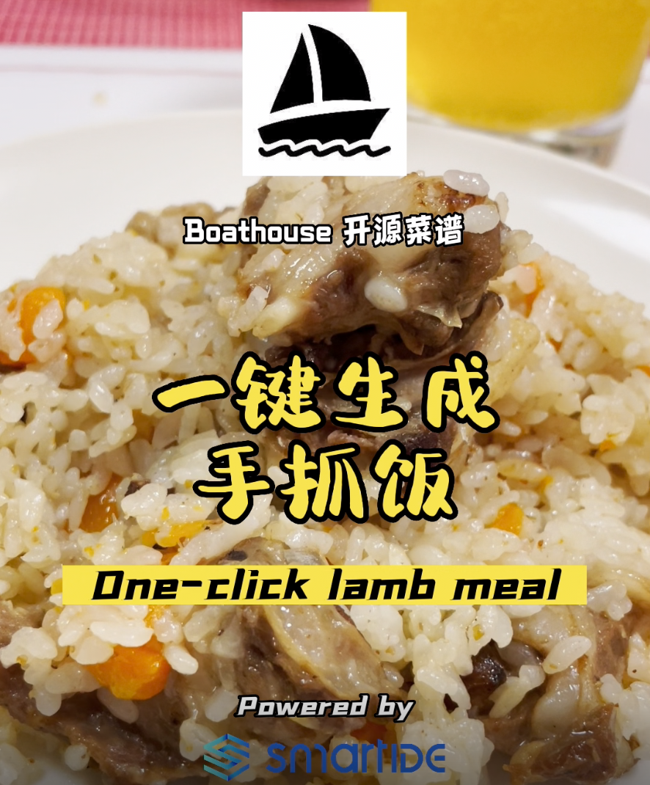
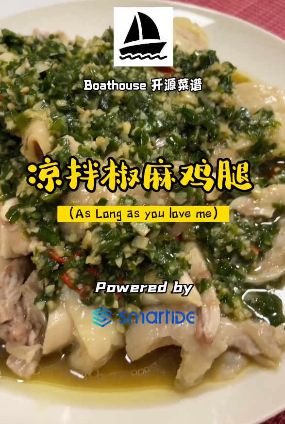

# Boathouse 开源菜谱

> Talk is cheap, show me the food!

> 键盘侠都能学会，有嘴就能吃的美味！

请关注【Boathouse船屋日记】微信视频号/抖音，持续分享高效程序员的工作和生活。要做会生活的程序员，首先要学会品鉴各种美食，品鉴美食最好的方式就是自己制作。

每周五持续更新一道美食菜谱，让程序员的周末也美味起来。

## 菜谱目录

- [快速生成照烧鸡 - Fast Deploy Teriyaki Chichken](docs/20220716-fastchichken/index.md)
  
  十分钟吃到嘴，十五分钟干完饭的程序员快餐标配。天下武功唯快不破，程序员的时间就是代码，代码就是金钱。在一个繁忙加班的周六中午，自己在家，代码写了一半，肚子饿了怎么办？快速发布照烧鸡就是你的最佳午餐选择，配一份米饭，随便扒拉一个青菜，一份营养又好吃的程序员午餐搞定。干完饭，继续去编码挖金吧。
  
  

- [异步回锅肉 - Async Call-Back Meat](docs/20220709-async-callback-meat/index.md)

  回锅肉制作工序简单，基本不会出Bug。因为肉要先异步处理好才能下锅，故称异步回锅肉。

  

- [一键生成手抓饭 One-click lamb meal](docs/20220630-oneclicklumbmeal/index.md)

  手抓饭这个东西，喜欢吃肉的小伙伴都喜欢。但是传统的手抓饭做法复杂，而且火候一旦掌握不好就会糊锅，需要一直蹲守在锅边才行。船长经过多次尝试，终于摸索出了使用电饭煲一键生成手抓饭的全自动做法。

  

- [凉拌椒麻鸡](docs/20220624-jiaomachicken/index.md)

  北京今天的气温已经接近40摄氏度了，这道凉拌椒麻鸡做法简单，清凉爽口，只需要大鸡腿，小葱和大蒜即可在1个小时内完成，非常适合夏季想吃肉又不想出汗的晚餐。

  

## 开源协议

本开源菜谱遵顼 **MIT开源协议**，具体请阅读协议文本 [LICENSE](/LICENSE)。