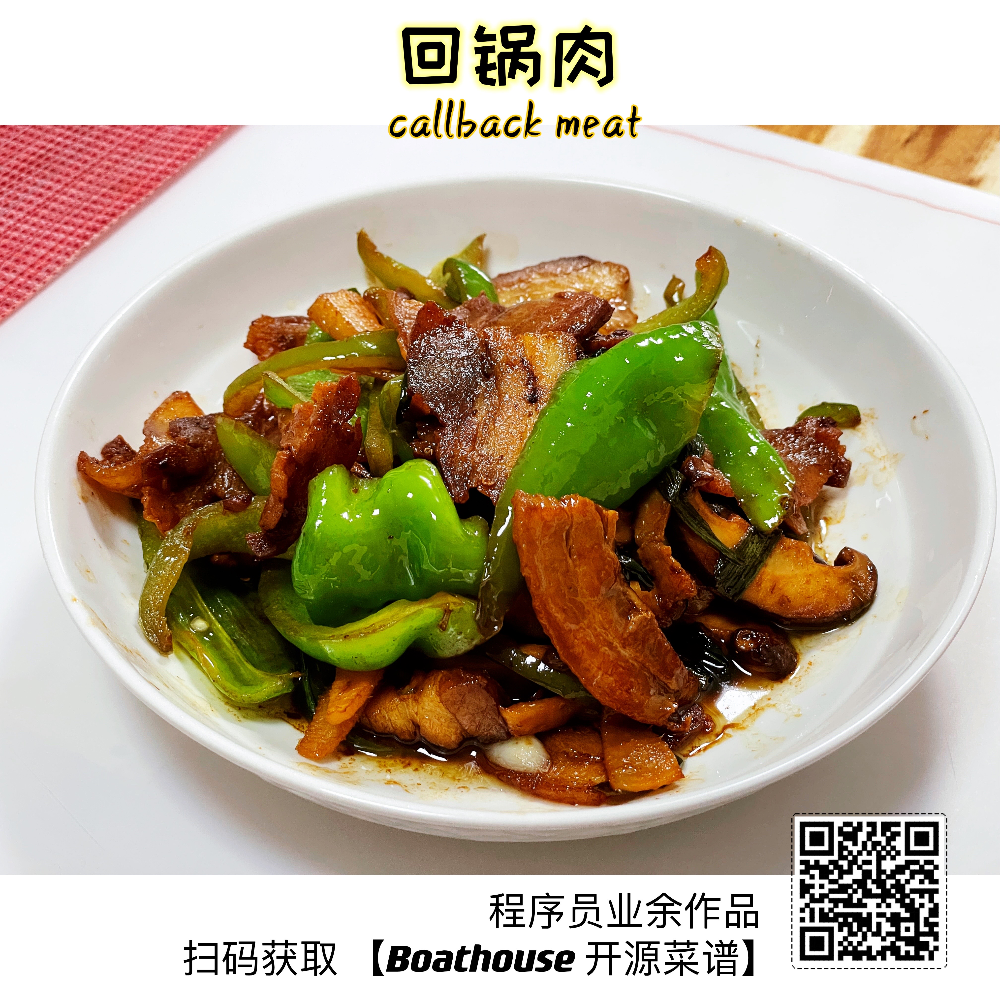

# 异步回锅肉 - Async Call-Back Meat

回锅肉制作工序简单，基本不会出Bug，是湖南四川一带的家常菜。因为肉要先异步处理好才能下锅，所以它的全名应该叫做【异步回锅肉】，回锅肉只是民间为了好记而使用的简称而已。很多人不吃辣的人觉得这道菜可能不太适合自己，我今天做的这道回锅肉是专门为不吃辣的朋友们改进过的，家里的小朋友都很喜欢吃，不信你可以问问我家阿诺。

  

## 原料

- 五花肉：肥瘦比例50/50，做回锅肉一定要有肥肉，如果太瘦的话会比较干，口感不好
- 青椒：不辣的那种，1-2个，看肉的量而定
- 螺丝椒：辣的那种，半个到1个，看个人对辣味的接受程度。传统的回锅肉只用螺丝椒不用青椒，所以会比较辣
- 葱姜蒜
- 豆瓣酱：可以选辣度比较低的，小朋友会比较容易接受
- 鸡蛋：1-2个，这个是湖南的做法，看个人口味也可以不放
- 香菇：这是我个人爱好，原版回锅肉也没有这个配料

## 装备

- 锅碗瓢盆
- 容器：docker或者podman均可，不需要k8s，除非你打算开食堂。

> 话说大厨比我们做IT的先进多了，人家一开始就是使用容器工作的。

## 工序

- 先将五花肉切成10厘米左右长度的方块，冷水下锅，放入姜片和花椒煮上20-30分钟。用筷子可以轻松穿透就可以了。
- 煮肉的同时煎1-2个荷包蛋，然后切成块。荷包蛋要全熟。
- 青椒切块/长条，螺丝椒切滚到块，香菇切片备好
- 煮好的五花肉捞出来，控干水分晾凉。控干水分和晾凉很重要，肉里有水分在煸炒的时候会爆锅造成人身伤害，不晾凉的肉不好切片。
- 五花肉切片，越薄越好，这样才能把肉煸炒的比较焦，会更有口感。刀工不好的小伙伴可以像我一样，一半切片，后面不好下刀了就直接切丁，肉丁炒出来也好吃。
- 把锅烧热放冷油，马上下切好的回锅肉。记住热锅冷油煸炒，是敲门，不然很容易爆锅受伤。
- 煸炒1-2分钟，用料酒烹一下。（想知道什么叫烹的同学可以看前面的菜谱）。主要要把料酒完全挥发掉，锅里只剩下油。这时再继续煸炒到肉成焦黄装，然后把锅里的油和肉一起盛出来。
- 把盛出来的油再倒回锅里，用这个油来炒菜会很有味道。
- 先放一勺豆瓣酱，葱姜蒜炒香，然后把配菜全放进去一起翻炒。这是要放一点点糖提鲜。
- 翻炒到配菜略微变软的时候把肉放进去一切翻炒，这时可以再放一些生抽，继续翻炒。
- 最后再烹上一点点锅边醋，这个就是让辣味菜适合小朋友的关键，醋可以中和辣味，让小朋友即可以吃到辣味，又不至于太刺激。所谓锅边醋，就是沿着热锅边放一点点醋，让醋快速挥发掉，只留下醋香。
- 出锅，开吃

## 视频演示

关注【Boathouse船屋日记】视频号/抖音，全程live demo，看了就会，每周五更新一道美食，丰富程序员的餐桌。

> 记得点赞关注 + Star

