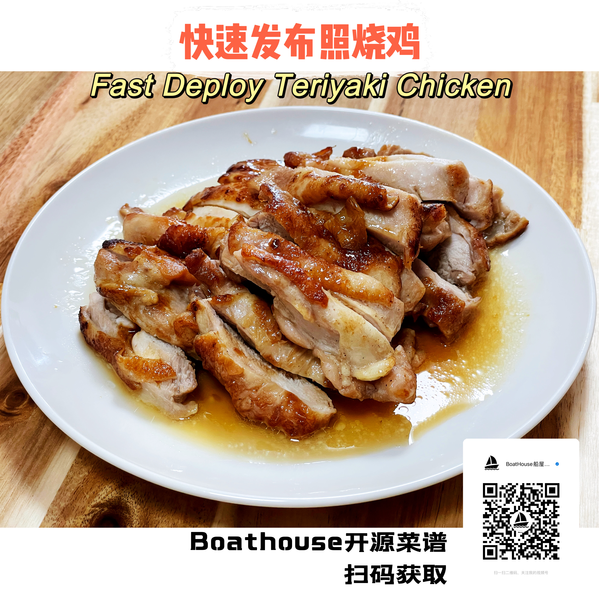

# 快速发布照烧鸡 - Fast Deploy Teriyaki Chicken

十分钟吃到嘴，十五分钟干完饭的程序员快餐标配。天下武功唯快不破，程序员的时间就是代码，代码就是金钱。在一个繁忙加班的周六中午，自己在家，代码写了一半，肚子饿了怎么办？快速发布照烧鸡就是你的最佳午餐选择，配一份米饭，随便扒拉一个青菜，一份营养又好吃的程序员午餐搞定。干完饭，继续去编码挖金吧。

> 扫描下图中二维码获取视频教程

  

## 原料

- 鸡腿排，超市都有卖，可以多买点冻起来，吃的时候提前1个小时拿出来解冻就够了
- 大蒜、大葱
- 生抽、料酒、蚝油、醋
- 盐、糖、胡椒粉
- 特饮
  - 宾得宝汽水
  - 巴黎水（气泡水）
  - 冰块

## 装备

- 锅碗瓢盆
- 容器：docker或者podman均可，不需要k8s，除非你打算开食堂。

> 话说大厨比我们做IT的先进多了，人家一开始就是使用容器工作的。

## 工序

- 先用叉子在鸡腿排上扎一些孔，这样方便腌渍的时候入味
- 鸡腿排放入容器，放入大蒜和大葱，加糖、盐、胡椒粉、生抽、蚝油盐渍10分钟接，天气热的时候最好包上保鲜膜放入冰箱
- 腌渍好的鸡腿排取出用厨房纸吸干表面的水份，这是为了煎制的时候不会爆锅
- 平底锅放适量的油，将鸡腿排鸡皮向下放入锅中，中火煎到鸡皮金黄焦脆
- 鸡腿排翻面儿以后，在之前的腌料里再加入醋，料酒和适量的水，直接倒入平底锅，盖上盖子焖煮5-6分钟即可。

## 视频演示

关注【Boathouse船屋日记】视频号/抖音，全程live demo，看了就会，每周五更新一道美食，丰富程序员的餐桌。

> 记得点赞关注 + Star

